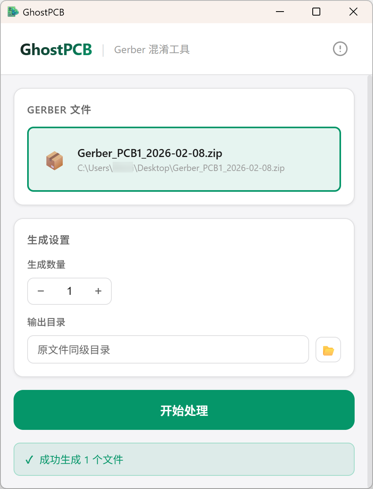

# GhostPCB

一个 Gerber 文件指纹混淆工具。异化 Gerber 文件，但生产出来是同样的 PCB。



## 功能特性

- **时间戳修改** - 替换文件内的日期时间信息
- **丝印层扰动** - 微调丝印层坐标 (±0.05mm)
- **几何结构扰动** - 钻孔坐标随机偏移 (±0.02mm)
- **文件结构混淆** - 插入冗余指令和随机注释
- **物理参数微调** - 外框尺寸微调 (±0.01mm)

## 技术栈

- 前端：React 19 + TypeScript + Vite
- 后端：Rust (Tauri 2.x)
- 核心处理：Rust 实现所有 Gerber 文件处理逻辑

## 使用方法

1. 选择或拖拽 Gerber ZIP 文件
2. 选择需要启用的混淆策略
3. 设置生成数量和输出目录
4. 点击"开始处理"

输出文件默认保存在原文件同级目录的 `GhostPCB_日期_原文件名` 文件夹中。

## 声明

此软件仅供个人学习使用，不可用于商业用途！严禁用于破解嘉立创免费打样的拆单检测！

## 开发

```bash
# 安装依赖
pnpm install

# 开发模式
pnpm tauri dev

# 构建
pnpm tauri build

# 运行测试
cd src-tauri && cargo test
```

## License

MIT
