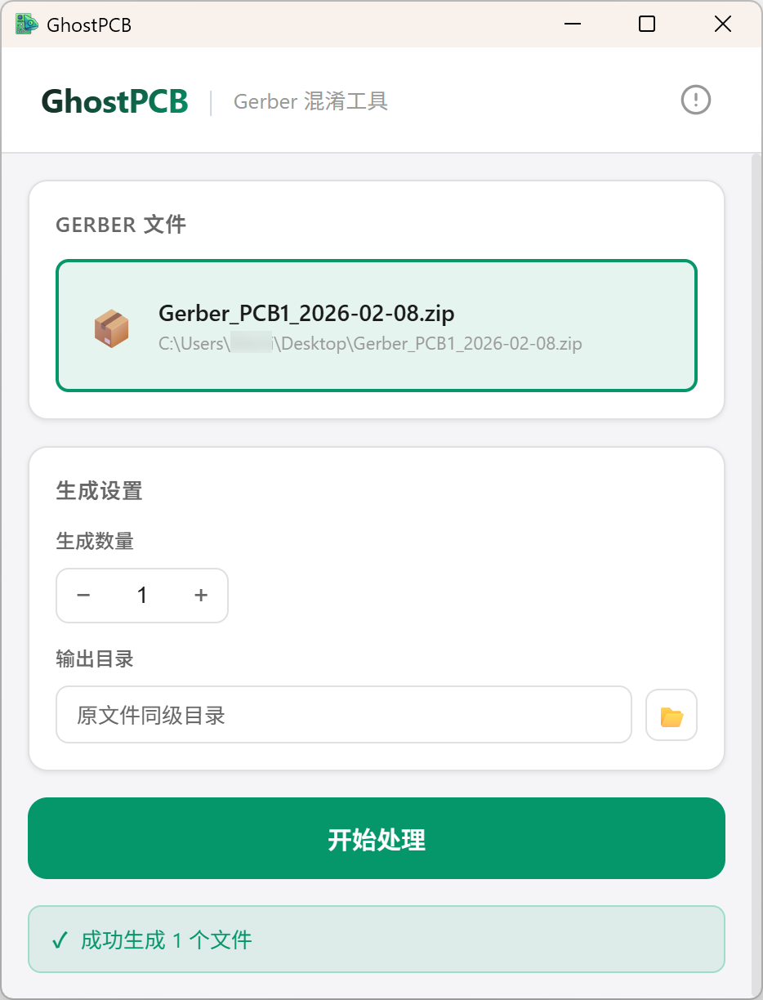

# GhostPCB

一个 Gerber 文件指纹混淆工具。异化 Gerber 文件，但生产出来是同样的 PCB。



## 技术栈

- 前端：React 19 + TypeScript + Vite
- 后端：Rust (Tauri 2.x)
- 核心处理：Rust 实现所有 Gerber 文件处理逻辑

## 使用方法

1. 选择或拖拽 Gerber ZIP 文件
2. 设置生成数量和输出目录
3. 点击"开始处理"

输出文件默认保存在原文件同级目录的 `GhostPCB_日期_原文件名` 文件夹中。

## 声明

此软件仅供个人学习使用，不可用于商业用途！严禁用于破解嘉立创免费打样的拆单检测！

## 开发

```bash
# 安装依赖
pnpm install

# 开发模式
pnpm tauri dev

# 构建
pnpm tauri build

# 运行测试
cd src-tauri && cargo test
```

## 特别鸣谢

- [zhang monday](https://github.com/zhangMonday)

## License

MIT
